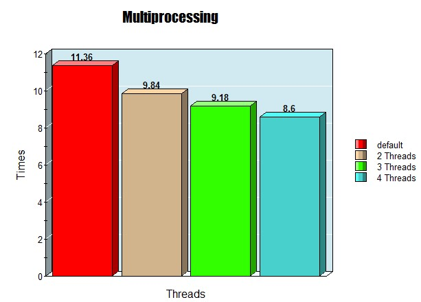

Your task is to produce a solution to a word search problem; this is the sort of thing printed in crossword magazines and so on. You’re given a grid of letters and have to find a word which appears horizontally or vertically in the grid. The grid consists only of the 26 letters in the range a…z and the words are not dictionary words, just random collections of up to 24 characters with an average length of 9 characters. There’s nothing special in those values, they’re just based on the corresponding values from /usr/share/dict/words on my computer.

In our case we’re only interested in words which appear vertically from top down and horizontally left to right. You are to flesh out the following implementation:

class WordSearch(object):
    ```def __init__(self, grid):
        pass
    ```    
    ```def is_present(self, word):
        return True```
In the __init__ method, grid is a string representing the entire word grid, with each row concatenated; there is no intervening separator, instead you will have to rely on the fixed row length ROW_LENGTH to determine the end of a row.

The is_present method returns True if word is present in the grid according to our rules. Your class will be used as follows

ws = WordSearch(grid)

for word in words_to_find:
    if ws.is_present(word):
        print "found {}".format(word)
Now the twist: the grid you will be given is a square grid with 10,000 (104) letters in each direction, i.e ROW_LENGTH = 10000. words_to_find is an array of 1,000,000 (106) words. And we’re looking for a solution which is optimised for run time efficiency. The sizes are not chosen for any specific magic reason, just to indicate that this is a ”big” problem.

We’re not looking for micro-optimisations in the code: if that were the case dispensing with Python might be a better idea! Instead look at the algorithm side of things.

As a bonus question: how would you go about taking advantage of a multicore system?

<br>---------------------------------------------------------------------------------------------------------------------<br>
### Cleaning up the string/ Processing the grid
The first task is to clean up the string, i.e. remove all the non alphabet characters so i used simple regex to do this.
I removed characters from the string until len(grid) was a square number.

###problems I had with this code
my first and initial attempt was a very niave way of doing this. essentially I would
separate the string into a list of strings (for rows and columns) each of length ROW_LENGTH. then I would
iterate through the list and check if the word is in the list using the in operator.
This obviously worked for a small 26x26 grid but it was not optimised for a large grid.
It took nearly 1 hour to run (I had gone for dinner and was surprised that the program was still running).
At this point I knew I had to do something better, so I rewrote the code to implement a more efficient solution.
I cut down the time to run to about 11-13 seconds.


### implementing the algorithm
I used a method ```getallsubstring(word)``` to create all possible combination of words inside the grid up to the `MAX_WORD_LIMIT`.
I would then store it inside a dictionary with the key being the word and the value being True. The value was not really used but 
the reason I chose to use a dictionary was because of keylookups costing O(1). There mathematically
isn't any possible way to get all substrings of a word faster than O(n^2). but I tried to optimise this by only getting 
substring of length greater than 1 and less than MAX_WORD_LENGTH. which saved space and time.

### Test cases
As expected all my testcases passed. i had used the unit test library 
to test my code. I had also used .txt with 10000 random words to test the efficiency of the code.
Additionally i always used print statements to double check that the code is working as expected.


### Bonus question
For the bonus question I used the same method to get all the substrings of the grid however 
I used multiple threads to generate the substrings. I used the multiprocessing library to do this.
I noticed that the time to run was much faster than the first attempt down to sub 9 seconds. however, creating 
 more than 2 threads made negligible difference. One Thread was assigned to getting all substring of the default grid
and the other threads were assigned to get all substring of the transposed grid. having threads do this in parallel
made the program run much faster. With even more optimisation I could easily run my program in less than 5 seconds 





 
